  <picture>
    <source media="(prefers-color-scheme: dark)" srcset="./agent-banner-light.svg"/>
    <source media="(prefers-color-scheme: light)" srcset="./agent-banner-dark.svg"/>
    
  </picture>

I build systems that turn rough ideas into things that actually work - mostly at the intersection of **NLP, search, and full-stack engineering**.

Not here to just write code. Here to ship systems that solve real problems.

---

### ⚡ What I build

- **Search & retrieval**- semantic search, hybrid retrieval, ranking pipelines that understand intent, not just keywords
- **NLP systems**- RAG pipelines, contradiction detection, document understanding. The kind of stuff where "it works on the demo" isn't good enough
- **Full-stack applications**- backend logic to frontend experience. APIs, data pipelines, and the UI that makes it all usable
- **Systems that connect things**- data to decisions, users to answers, messy inputs to structured outputs

Basically from "this would be cool" → to "this actually works"

---

### 🛠 How I work

Ship fast, refine relentlessly. First drafts are messy - final systems aren't.

I care about the gap between *"technically possible"* and *"actually usable."* Most of my work lives there.

Active in open-source contributions and hackathons

---

### 🧰 Some Tools & technologies

**languages**

  
  
  
  
  
  

**AI / ML**

  
  
  
  
  
  
  
  
  
  

**Frameworks & infra**

  
  
  
  
  
  
  
  
  

**LLMs & vibe coding**

  
  
  
  
  
  
  
  
  

---

### 🤝 Let's build something

If you're hiring, collaborating, or have a problem worth solving - &#160;&#160;

---

  <i>Still learning. Still building. Always shipping.</i>

