  

I build systems that turn rough ideas into things that actually work - mostly at the intersection of **NLP, search, and full-stack engineering**.

Not here to just write code. Here to ship systems that solve real problems.

---

### What we can build together
If you bring an idea, a problem worth solving, or just curiosity — I can turn it into:

AI-powered tools - LLMs, RAG, NLP systems
Intelligent search - semantic + hybrid retrieval
full-stack applications - backend logic to frontend experience
systems that connect data, users, and decisions

from "this would be cool" → to "this actually works"

---

### How I work

Ship fast, refine relentlessly. First drafts are messy — final systems aren't.

I care about the gap between *"technically possible"* and *"actually usable"*. Most of my work lives there.

---

### Let's build something

If you're hiring, collaborating, or have a problem worth solving — charusneha266@gmail.com.

---

  <i>still building. still learning. still not done.</i>

